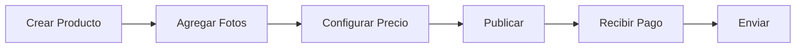

# Manual Multimedia Automático

Creá manuales multimedia del producto pensados para enseñar a usarlo, con 3 niveles de entendimiento.

## Frases que Activan esta Skill

- "Creá el manual del producto"
- "Documentación multimedia"
- "Tutorial paso a paso"
- "Guía de uso"
- "Enseñar a usar el sistema"
- "Manual por niveles"
- "Documentación para clientes"

## Estructura de 3 Niveles

```
📚 MANUAL MULTIMEDIA
│
├── 🟢 NIVEL 1: BÁSICO
│   │  Para: personas sin conocimientos técnicos
│   │  Tono: simple, amigable, visual
│   │
│   ├── ¿Qué es y para qué sirve?
│   ├── Paso a paso ilustrado
│   ├── Videos cortos (< 2 min)
│   └── FAQ básico
│
├── 🟡 NIVEL 2: INTERMEDIO
│   │  Para: usuarios habituales
│   │  Tono: práctico, orientado a resultados
│   │
│   ├── Flujos completos
│   ├── Casos de uso reales
│   ├── Resolución de problemas
│   └── Tips y atajos
│
└── 🔴 NIVEL 3: AVANZADO
    │  Para: administradores y técnicos
    │  Tono: técnico, detallado
    │
    ├── Arquitectura general
    ├── Integraciones (APIs)
    ├── Automatizaciones
    └── Configuración avanzada
```

## 1. Template Nivel Básico

### Estructura de Página

```markdown
# 🟢 Guía Básica

> Para personas que recién empiezan. Sin tecnicismos.

---

## ¿Qué es [Producto]?

[Producto] es una herramienta que te permite **[beneficio principal]** 
de forma simple y rápida.

**En palabras simples:** [analogía cotidiana]

📹 [VIDEO: Qué es y cómo funciona - 90 segundos]

---

## Primeros Pasos

### 1. Crear tu cuenta


1. Entrá a **tuapp.com**
2. Hacé clic en "Crear cuenta"
3. Completá tu email y contraseña
4. Listo! Ya estás adentro

⏱️ Tiempo: 2 minutos

---

### 2. Completar tu perfil


1. Hacé clic en tu foto (arriba a la derecha)
2. Elegí "Mi Perfil"
3. Completá tus datos
4. Guardá los cambios

💡 **Tip:** Subí una foto para que tus clientes te reconozcan

---

### 3. Tu primer [acción principal]


Seguí estos pasos:

| Paso | Acción | Resultado |
|------|--------|-----------|
| 1 | Clic en "Nuevo" | Se abre el formulario |
| 2 | Completá los datos | Los campos se llenan |
| 3 | Clic en "Guardar" | ¡Listo! Ya está creado |

📹 [VIDEO: Tutorial completo - 3 minutos]

---

## Preguntas Frecuentes

<details>
<summary>❓ ¿Cómo recupero mi contraseña?</summary>

1. En la pantalla de login, hacé clic en "Olvidé mi contraseña"
2. Ingresá tu email
3. Revisá tu bandeja de entrada
4. Seguí el link del email

</details>

<details>
<summary>❓ ¿Puedo usar la app en el celular?</summary>

¡Sí! La app funciona en cualquier celular con navegador.
Simplemente entrá a tuapp.com desde tu celular.

</details>

---

## ¿Necesitás más ayuda?

- 💬 Chat de soporte (abajo a la derecha)
- 📧 soporte@tuapp.com
- 📖 [Ver Guía Intermedia →]
```

## 2. Template Nivel Intermedio

```markdown
# 🟡 Guía Intermedia

> Para usuarios que ya conocen lo básico y quieren sacar más provecho.

---

## Flujos Completos

### Caso: Vender un Producto



**Paso a paso detallado:**

#### 1. Crear el producto
- Título claro y descriptivo (máx 60 caracteres)
- Descripción con beneficios, no solo características
- Categoría correcta para mejor visibilidad

#### 2. Fotos que venden
- Mínimo 3 fotos
- Fondo blanco o neutro
- Buena iluminación
- Mostrar el producto en uso

📹 [VIDEO: Cómo hacer fotos que venden - 5 min]

#### 3. Precio estratégico
- Revisá precios de competencia
- Incluí costo de envío en el cálculo
- Dejá margen para ofertas

---

## Resolución de Problemas

### El pago quedó pendiente

**¿Por qué pasa?**
- El cliente eligió pagar en efectivo (Rapipago/Pago Fácil)
- El banco está verificando la transacción
- Problema con la tarjeta del cliente

**¿Qué hacer?**
1. Esperá 24-48 horas
2. Si no se aprueba, contactá al cliente
3. Ofrecé otro método de pago

### El stock no se sincroniza

**Checklist:**
- [ ] ¿Está conectada la cuenta de ML?
- [ ] ¿El producto está mapeado correctamente?
- [ ] ¿Hay errores en el panel de sincronización?

**Solución rápida:**
1. Ir a Productos > Sincronización
2. Clic en "Forzar sync" en el producto
3. Verificar en ML que actualizó

---

## Tips Avanzados

### Atajos de teclado
| Atajo | Acción |
|-------|--------|
| `Ctrl + N` | Nuevo producto |
| `Ctrl + S` | Guardar |
| `Ctrl + P` | Publicar |
| `/` | Buscar |

### Automatizaciones útiles
- **Auto-responder:** Configura respuestas automáticas a preguntas frecuentes
- **Stock bajo:** Recibe alertas cuando el stock baja de X unidades
- **Reportes:** Programa reportes semanales por email
```

## 3. Template Nivel Avanzado

```markdown
# 🔴 Guía Avanzada

> Documentación técnica para administradores y desarrolladores.

---

## Arquitectura del Sistema

```
┌─────────────────────────────────────────────────────┐
│                    FRONTEND                          │
│                   Next.js 14                         │
│              (App Router + RSC)                      │
└─────────────────────┬───────────────────────────────┘
                      │
┌─────────────────────▼───────────────────────────────┐
│                   BACKEND                            │
│                  Supabase                            │
├─────────────────────────────────────────────────────┤
│  Auth          │  Database      │  Storage          │
│  PostgreSQL    │  RLS           │  Edge Functions   │
└─────────────────────────────────────────────────────┘
                      │
┌─────────────────────▼───────────────────────────────┐
│               INTEGRACIONES                          │
├─────────────────────────────────────────────────────┤
│  Mercado Pago  │  Mercado Libre │  Notion           │
│  (Pagos)       │  (Ventas)      │  (Docs)           │
└─────────────────────────────────────────────────────┘
```

## APIs Disponibles

### Autenticación
Todas las requests requieren header:
```
Authorization: Bearer <access_token>
```

### Endpoints Principales

| Método | Endpoint | Descripción |
|--------|----------|-------------|
| GET | `/api/products` | Listar productos |
| POST | `/api/products` | Crear producto |
| PUT | `/api/products/:id` | Actualizar producto |
| DELETE | `/api/products/:id` | Eliminar producto |

### Ejemplo de Request

```bash
curl -X POST https://api.tuapp.com/products \
  -H "Authorization: Bearer xxx" \
  -H "Content-Type: application/json" \
  -d '{
    "title": "Producto Test",
    "price": 1500,
    "stock": 10
  }'
```

## Webhooks

### Configuración
1. Ir a Configuración > Webhooks
2. Agregar URL de destino
3. Seleccionar eventos

### Eventos Disponibles
- `order.created` - Nueva orden
- `order.paid` - Orden pagada
- `product.stock_low` - Stock bajo
- `sync.completed` - Sincronización completada

### Payload de Ejemplo
```json
{
  "event": "order.paid",
  "timestamp": "2024-01-15T10:30:00Z",
  "data": {
    "order_id": "uuid",
    "amount": 1500,
    "customer_email": "cliente@email.com"
  }
}
```

## Configuración Avanzada

### Variables de Entorno
```env
# Supabase
NEXT_PUBLIC_SUPABASE_URL=
SUPABASE_SERVICE_ROLE_KEY=

# Mercado Pago
MERCADOPAGO_ACCESS_TOKEN=
MERCADOPAGO_PUBLIC_KEY=

# Mercado Libre
ML_APP_ID=
ML_CLIENT_SECRET=
```

### Rate Limits
| Endpoint | Límite |
|----------|--------|
| API general | 100 req/min |
| Webhooks | 1000/día |
| Sync ML | 50/hora |
```

## 4. Generador Automático

```typescript
// lib/manual-generator.ts
interface ManualSection {
  level: 'basic' | 'intermediate' | 'advanced';
  title: string;
  content: string;
  media?: {
    type: 'image' | 'video' | 'gif';
    url: string;
    caption: string;
  }[];
}

export async function generateManual(productName: string, features: string[]) {
  const sections: ManualSection[] = [];
  
  // Generar nivel básico
  sections.push({
    level: 'basic',
    title: `¿Qué es ${productName}?`,
    content: generateBasicIntro(productName, features),
    media: [{ type: 'video', url: 'intro.mp4', caption: 'Introducción' }]
  });
  
  // Generar pasos para cada feature
  for (const feature of features) {
    sections.push({
      level: 'basic',
      title: `Cómo usar: ${feature}`,
      content: generateStepByStep(feature),
      media: [{ type: 'gif', url: `${feature}.gif`, caption: `Tutorial ${feature}` }]
    });
  }
  
  // Generar flujos intermedios
  sections.push({
    level: 'intermediate',
    title: 'Flujos Completos',
    content: generateWorkflows(features)
  });
  
  // Generar docs técnicos
  sections.push({
    level: 'advanced',
    title: 'Arquitectura',
    content: generateArchitectureDocs()
  });
  
  return sections;
}
```

## Checklist de Implementación

### Contenido
- [ ] Nivel básico completo
- [ ] Nivel intermedio completo
- [ ] Nivel avanzado completo
- [ ] FAQ por nivel

### Media
- [ ] Capturas de pantalla
- [ ] GIFs de acciones
- [ ] Videos tutoriales
- [ ] Diagramas de flujo

### Formato
- [ ] Mobile-first
- [ ] Navegación clara
- [ ] Búsqueda funcional
- [ ] Links internos

## Presentar Resultados al Usuario

```
✓ Manual Multimedia creado

**Estructura:**
- 🟢 Nivel Básico: 8 secciones
- 🟡 Nivel Intermedio: 5 flujos
- 🔴 Nivel Avanzado: 4 docs técnicos

**Media incluida:**
- 15 capturas de pantalla
- 8 GIFs animados
- 3 videos tutoriales
- 4 diagramas

**Acceso:**
- /docs/basico
- /docs/intermedio
- /docs/avanzado

**Próximos pasos:**
1. Revisar contenido
2. Grabar videos pendientes
3. Publicar en Notion

¿Querés que genere el contenido específico?
```
